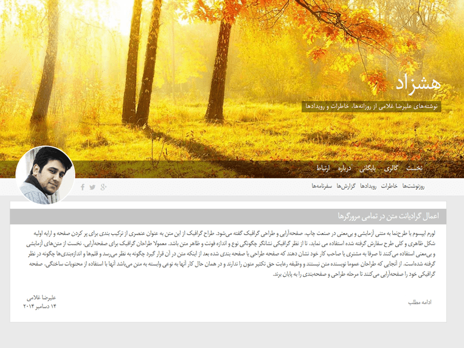

# Nihil
Nihil is a free, light, modern, responsive and Open-Source wordpress theme

## How to Download
This is a old-school project and still have some bugs, Use it by your own risk or if you're a developer and can fix this bugs by yourself.

Checkout releases page https://github.com/arazgholami/nihil/releases

## Contribution
Any contribution are welcome.

## Authors
Araz Gholami <https://arazgholami.com>

## License
Nihil is licensed under The MIT License. Which means that you can use, copy, modify, merge, publish, distribute, sublicense, and/or sell copies of the final products. But you always need to state that Araz Gholami is the original author of this theme.

## Contact
Araz Gholami contact@arazgholami.com 

## Changelogs
### v0.1
- Minimal, Moden and Responsive Layout
- Minimum size & minimum HTTP request
